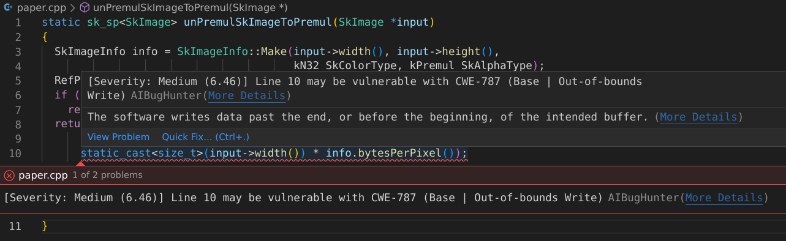

# AI Bug Hunter VSCode Extension

AI-based software vulnerability prediction IDE plug-in that was trained using data from National Vulnerability Database (NVD), which can generate vulnerability predictions for a source code function.

> This is a very early preview of the extension with a lot of improvements to be made in the future. As of version 1.0.0, the extension does not include one of the major features: repair, although this feature is scheduled to be released soon.

## Short Demo Video
[](https://youtu.be/sSV2XjxJfkM "Demo")

## Features

The extension will highlight the vulnerable line in the source code and the ML models will predict the following:

1. The potentially vulnerable line in a function
2. The types of the predicted vulnerability (i.e., CWE-ID, CWE Type)
3. The severity of the predicted vulnerability
4. The potential fix to the vulnerability

AIBugHunter will provide accurate vulnerability predictions that enable software developers to detect vulnerabilities in their IDE.

Our tool will have an interface that looks like the image below.



All you have to do is open any C/C++ file, and the tool with automatically start analysing in real time - the analysis should only take couple of seconds.
The file is analysed every time you modify the file, and it will start analysis after defined amount of time after stopping typing. (Refer to Extension Settings)

## Requirements

### Local Inference

This extension will use the local inference mode by default, which runs a generic Python script containing the inference code. This requires some packages to be installed.

1. Navigate to the [Local Inference Repository](https://github.com/aibughunter/local-inference)
2. Download `requirements.txt`
3. Run the following command:

```bash
pip3 install -r requirements.txt
# or manually
pip3 install numpy onnxruntime torch transformers

# If you intend to use the GPU and you are not on MacOS or ARM processor
# You may replace onnxruntime with onnxruntime-gpu
```

Refer to the [ONNX Runtime Website](https://onnxruntime.ai/docs/get-started/with-python.html#install-onnx-runtime) to determine whether to install `onnxruntime-gpu` or `onnxruntime` on your machine


### Remote Inference

There are two ways you can deploy an on-premise inference server:

1. Running generic Python script with Uvicorn ([aibughunter/remote-inference-py](https://github.com/aibughunter/remote-inference-py))
2. Deploy using Docker Image provided <-- Recommended method ([aibughunter/remote-inference-docker](https://github.com/aibughunter/remote-inference-docker))

Refer to the respective repository's README on the deployment guide.

## Extension Settings

This extension provides the following settings:

* `AiBugHunter.diagnostics.delayBeforeAnalysis`: Delay after paused typing before analysis (in milliseconds)
* `AiBugHunter.diagnostics.diagnosticMessageInformation`: Select specific information to be displayed on the diagnostics UI
* `AiBugHunter.diagnostics.highlightSeverityType`: Select the highlight severity type (i.e. the colour of the underline and it's classification)
* `AiBugHunter.diagnostics.informationLevel`: Fluent or Verbose way of displaying the message. Fluent would be easier to read, verbose provides more information.
* `AiBugHunter.diagnostics.maxNumberOfLines`: Top-n number of vulnerable lines to be highlighted
* `AiBugHunter.diagnostics.showDescription`: Boolean to choose to show CWE description or not
* `AiBugHunter.inference.inferenceMode`: Select Inference Mode. Local or On-Premise inference. On-Premise allows you to self-host inference server in a separate machine/server
* `AiBugHunter.inference.inferenceServerURL`: Define the URL/IP of the on-premise server
* `AiBugHunter.inference.useCUDA`: Option to use CUDA as an inference accelerator (NVIDIA GPUs only)

## Known Issues

- Overly sensitive predictions
- CUDA mode on local inference does not provide any speed improvements
- Repair feature not implemented yet
- Data sent to the model can be reduced by selectively sending functions (Only functions modified)

## Release Notes

### 1.0.0

Initial release of AIBugHunter

---

## Acknowledgements

This AIBugHunter VSCode Extension Project is using Machine Learning Models published in the following publications:

```
Fu, Michael & Tantithamthavorn, Chakkrit. (2022). LineVul: A Transformer-based Line-Level Vulnerability Prediction. 10.1145/3524842.3528452. 

Fu, Michael & Tantithamthavorn, Chakkrit & Le, Trung & Le, Trung & Nguyen, Van & Phung, Dinh. (2022). VulRepair: A T5-Based Automated Software Vulnerability Repair. 10.1145/3540250.3549098.
```

The replication packages of which are available here:

- [LineVul](https://github.com/awsm-research/LineVul)
- [VulRepair](https://github.com/awsm-research/VulRepair)
